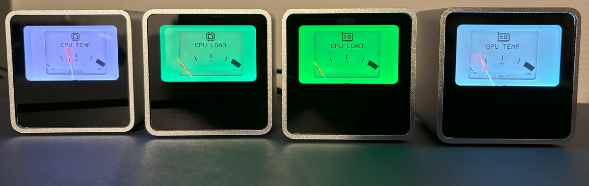
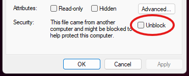
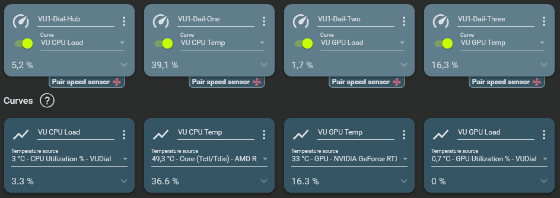

# FanControl.VUDialPlugin.Release
Plugin for FanControl that updates [Streacoms](https://streacom.com/) [VU1 Dials](https://vudials.com/)
This plugin registers the VU1 Dials as controls in Fan Control, enabling the pairing of these dials with sensors. Additionally, the plugin registers two sensors: one for CPU load and another for GPU load to use with the dials.
  

## Disclaimer
**Use this software at your own risk. It has been tested solely on my personal setup, and there may be aspects that I have missed or overlooked.**

## Features
- Injects VU Dials into Fan Control as controls to be updated by sensor input.
- Injects Performance counters as sensors for CPU and GPU utilization percentage. Can be turned off in configuration.
- Make your own background images for the dials and assign them to dials through configuration.
- Control lightning color on dials.
- Dynamic lightning feature that adjusts the color tint of the dial when its values approach the extremes.

## How to install
1. Download and install [Fan Control](https://getfancontrol.com/)
2. Download, extract and copy all [Fan Control plugin files](https://github.com/ChiefTomato/FanControl.VUDialPlugin.Releases/releases/download/V003/FanControl.VUDialPlugin.zip) to the Fan Control plugin folder (typically C:\Program Files (x86)\FanControl\Plugins). You might need to unblock all DLL files in their file properties.
  

3. Download, Install and run [VU-Server](https://github.com/SasaKaranovic/VU-Server)
4. Open a browser and navigate to the VU-Server web console (Default URL: http://localhost:5340).
  - Ensure that all dials are detected by the VU-Server before proceeding.
  - In the main section of the VU-Server, ensure that each dial is uniquely named. You will need these names later. If you have a VU1 starter pack and do not feel creative, you can use the naming scheme provided in the plugin configuration file and copy those in.
  - In the API section, generate a new API key for Fan Control. **Ensure that the dials you wish to manage with Fan Control are included for the key.**
  - Copy the API key to use in the next step.
    
5. In File Explorer, navigate to <path> and open the config.json file using Notepad or a similar text editor. As this is a JSON file, ensure that the structure remains valid while making any changes.
  - Add your API key from above in the "APIKey": "your key here" section.
  - Set DynamicLightning to either true or false. This option adjusts the color tint of the dial when its values approach the extremes, shifting towards green for lower values and red for higher values.
  - In the dialConfigurations make sure that you have a configuration section for each of your dials.
  -     {
            "Name": "VU1-Dial-Hub",
            "DefaultColor": "#CC6600",
            "Background": "cpu-load.png",
            "DynamicLightning": "true",
            "DynamicLightningLowerTreshold": "30",
            "DynamicLightningLowerColor": "#008000",
            "DynamicLightningUpperTreshold": "70",
            "DynamicLightningUpperColor": "#FF0000"
        }
  - Each dial configuration section must have a unique name that corresponds to the name of the dial in VU-Server.
  - You can specify the background image to be used for each dial. Images should be placed in the image folder alongside the plugin.
  - You can specify the default color for each dial and set up dynamic lightning.
   
6. Launch Fan control
  - Your dials should now appear as fan cards (controls) in the Fan Control interface.
  - For each dial (Control), create a Curve using the sensor you want as input. Adjust the curve and values to match your preference. Please refer to the [Fan Control documentation](https://getfancontrol.com/docs/) for details on this.
    

## Troubleshooting tips
- Quit and restart Fan Control. Make sure it is not running in the background. Make sure that you follow the setup sequentially and that the dial naming from the VU Server is 1:1 the same as in the configuration file.
- If you want to make changes to the config, make sure to restart Fan Control for the changes to be picked up.
- Look in the Fan Control log for errors that could give a hint to the problem you are facing.

## Why use Fan Control to drive the VU1 dials?
- Fan Control is a great piece of software with simple and easy to use plugin architecture. Go support Rémi Mercier on the continued development of Fan Control.
- It has a control/sensor structure that maps great to the VU Dial use case.
- I'm already using Fan Control and I don't need another program to run in the background to control my dials.
- A HWInfo plugin exists for Fan Control, so it should be possible to use HWInfo sensors as source for VU Dial through the plugin.
